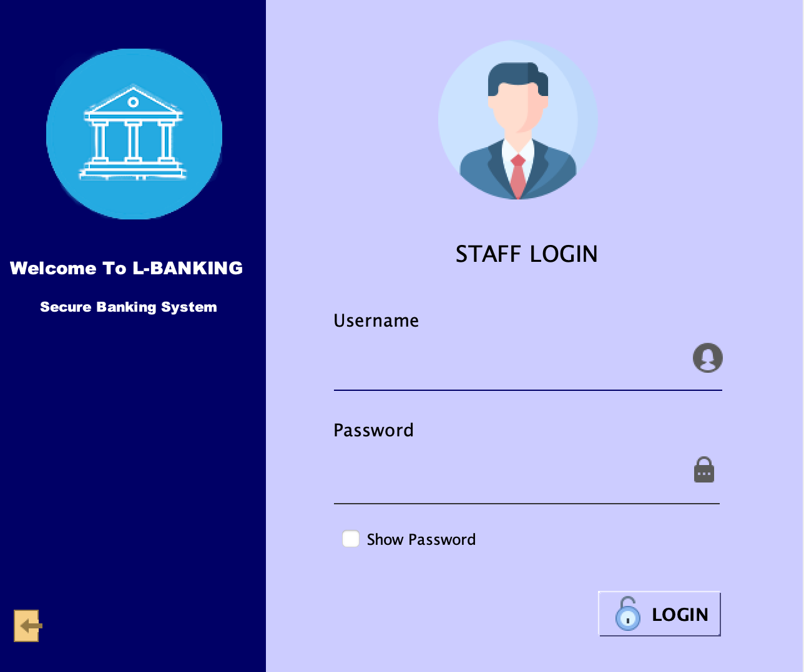
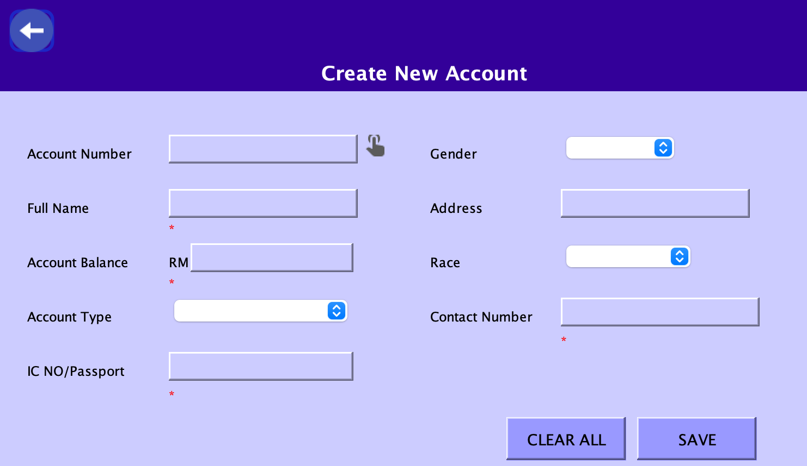
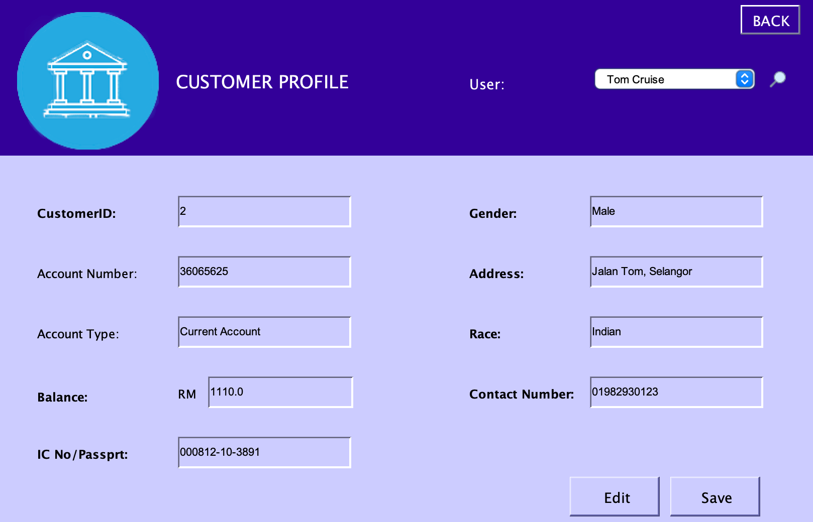
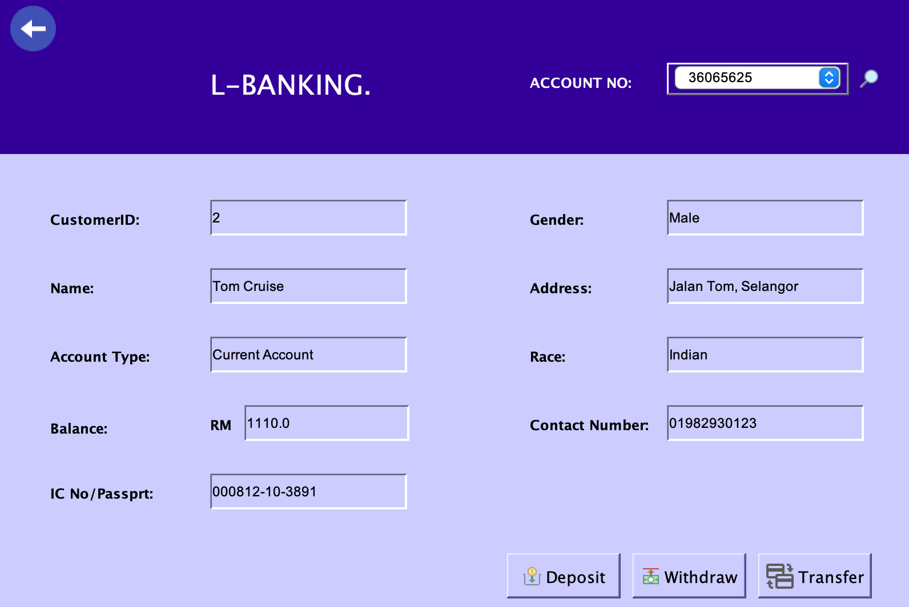

# Banking System

## Overview

This Banking System Admin Interface is a robust application designed to manage customer accounts and perform various banking transactions. Developed using Apache NetBeans and object-oriented programming concepts, it provides administrators with the tools to efficiently handle account registrations, updates, and financial operations.

## Main Features

- **Register New Account**

- **Edit Customer Account Details**

- **Perform Transactions**

## Technologies Used

- **Apache NetBeans**
  - Development environment used for building the application.
  
- **Object-Oriented Concepts**
  - Utilized for structuring the application and enhancing maintainability.

## Screenshots

### Login Page

### Dashboard
- Dashboard where admin can choose to create, edit or perform transaction for customer.

### Create Account

### Edit Details
- All the details below are just a test user.  

### Perform Transaction
- Allow customer to deposit, withdraw and transfer money to another account. 

